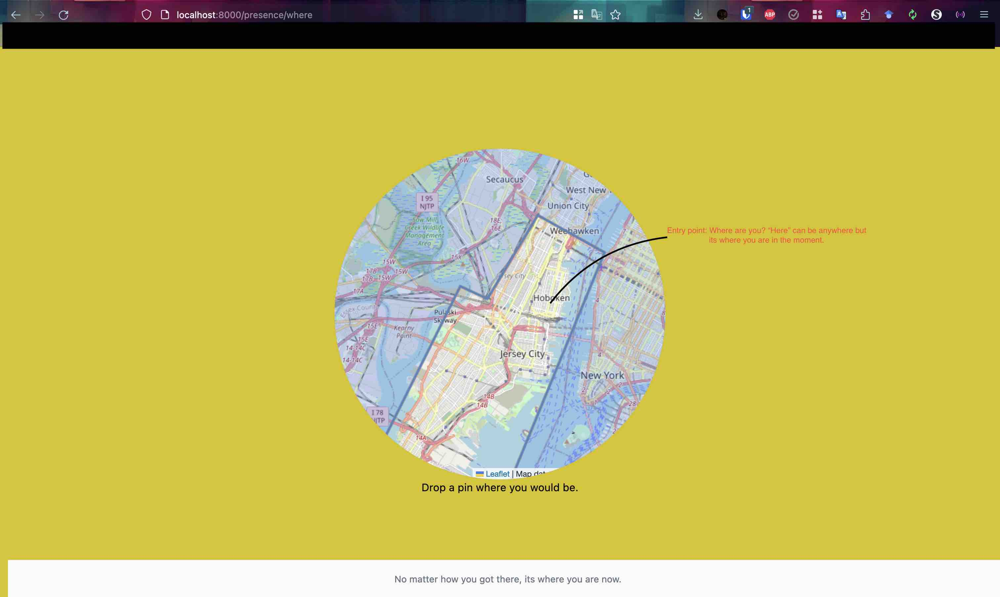
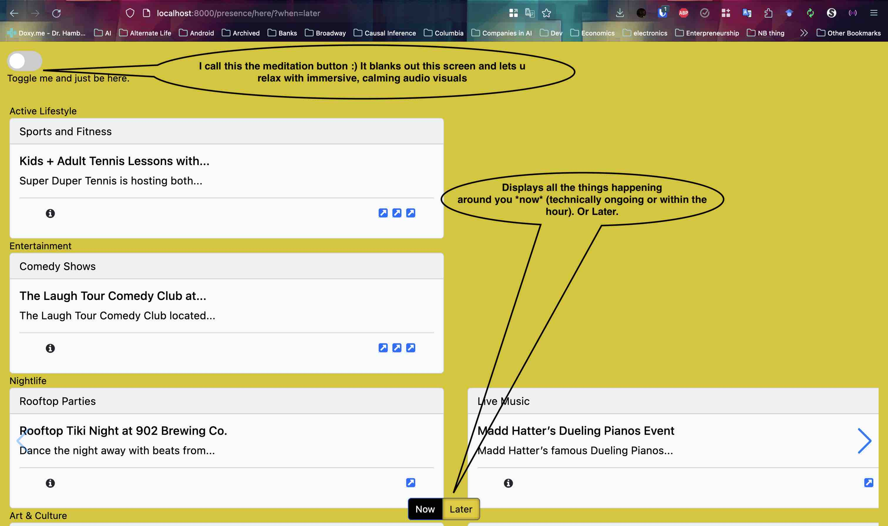

# What is this [demo](http://drophere.me)?
When we Explore and Travel and search for something around us, the Search experience on Yelp and Google dissapoints me. I find that these engines are poor for what you *can do now* vs later and cannot personalize it based on your Context(preferences, weather etc).

Drop is location and time aware: You can narrow the things happening around you Now(vs Later or already occured events) and it can take Contextual cues like Weather, Distance and present search results in a more aware(almost meditative) manner.

The REST routes of the website encapsulate the idea that we should focus on the now first. Everything else is later and takes you away from the now.

I have utilized AI (LLMs), OpenRouteService, FastAPI and K8s for building the backend as well as experimented extensively with GPT tools to help me write the code for it.
The backend for this tech is [here](http://github.com/itissid/Drop-PoT.git)

## Here == Location and Now/Later == Time
#### You always start with the *Where*:
[/presence/where](http://drophere.me/presence/where)
Plant a pin *Here* :)

### A Pin is planted *here* and thus its where you are.

You are now dropped into the *Now* screen, the route is: [/presence/here/?when=now](http://drophere.me/presence/here/?when=now&lat=40.74816730666263&long=-74.04544830322267).

The UI has catagorized events happening *Now*(technically in < 1 hour or ongoing) around you.

### But we are also explorers, A Button press takes you to the *Later*: 
[/presence/here/?when=later](http://drophere.me/presence/here/?when=later&lat=40.74816730666263&long=-74.04544830322267)

*Later* UI has events technically happening > 1 hour from now or not on going.

### Not do anything, just relax?

If you just want Zen with immersive sound and visuals, toggle the screen with the button on the top left.

---- 
## How is this about travelling?
I consider myself a weekend traveller most of times and the Site has exactly that content. I go to explore the city and people around me on those days. This is a tool for a usecase of 1(at the moment). I hope it can grow.

# Who am I?
Awareness and being conscious of this moment are two ideas close to my heart. I also love to travel but one can also be a "traveller" within their city(One might say we all travel on the weekend) exploring places big and small. I live in Hoboken, NJ so the demo is only content from there.

# Tech stack
- This repo is just the front end(FastAPI, Jinja, Bootstap CSS, Swiper.js).
- It shows off the "*new*" AI for extracting structure from unstructured text to power website using basic RAG and Single Shot Retrieval. 
- The API and Data pipes that uses Smarts(OpenAI), OpenRouteService, FastAPI all in Python; It scrapes, augments and indexes the data into a DB (in Sqlite!).
The last two bits live in another repo [here](http://github.com/itissid/Drop-PoT.git)

# Demo navigation
~(I am about to deploy the docker to the cloud, but here are some screenshots from the local docker container to explain the idea)~
The site is now [live](drophere.co)
> *Landing Page: Drop a pin within the area(no location permissions requested)*


> *Next: The "Conscious Exploration" bits of :)*


> *Also importantly: The use of modern AI: A pipeline to retrieve structured info from unstructured text and use RAG(embeddings and the like) to enrich and classify the  content... So it does not appear like a smorgasbord of information.*


The stack that uses AI and generates the DB(in Sqlite!) is [here](http://github.com/itissid/Drop-PoT)

# What this repo contains?
The front end which calls the backend([here](http://github.com/itissid/Drop-PoT) and all the opsy stuff to get it onto a cloud(Ongoing).


# Stuff specific to building the demo(Opsy)
Docs are a WIP so things may not work in the short term as expected
## Building and Distributing the Wheel.
There were a lot of package install errors(Oh debian linux how precise you are) and wrangling with the initial pyproject.toml dependencies 
that needed rust/c++ etc. Often there were errors and it took a fair bit of time building them from wheels/sdists, so I removed the deps that were not needed to build these packages, cutting down immensely on the size of the final installed binaries. This took a while...

Iteration Loop(`code=>build=>deploy`): 
1. Build the wheel of the `drop_backed` project. Update it in the `herenow_demo`. Both of these should be installable via pip.
> A thing to note about moving a dep to `tool.poetry.dependencies.dev` is that `poetry build`'s wheels don't exclude any deps from the pyproject.toml in whatever section it is as explained [here](https://github.com/python-poetry/poetry/issues/2567#issuecomment-1100038202), but we can use `extras` in poetry and set the optional=true on them so that later pip does not install them unless we ask.

2. Once tested(from local docker), the builds will be tagged. We can copy them from the containers and push to pypi or we can just build and push wheels from the locally tested code.
3. Then Use a second docker container to install these built artifacts in a docker container
4. Push the docker container to a registry where it can be 
deployed to a k8s/ec2/gws etc cluster.

## Docker 1(DockerfileBuild): Tests if the wheels can be built and installed using pip:
0. Write code, test, once done prune unwanted deps in `drop_backend` from its pyproject.toml.
 -  Run setup_drop_build to copy the code for docker build to find in its context:
 ```
 python -m herenow_drop.setup_drop_build --pot-source=local --demo-source=local --pot-dir=/Users/sid/workspace/drop/ --demo-dir=/Users/sid/workspace/herenow_demo/
 ```
 > This creates a sandbox where the code for both projects is copied and then in that sandbox the script bumps the major/minor/patch version in pyproject.toml in ``drop_backend`` example `x.y.z` becomes alpha `x.y.(z+1)-alpha`. This will be useful later.

1. Run docker build to build the `drop_backend` project like so:
```
docker build --target backend-builder \
--build-arg DROP_BACKEND_DIR=drop_PoT \
--build-arg HERENOW_DEMO_DIR=herenow_demo  \
-t backend-image -f DockerfileBuild /tmp/subdir
```

- 1.1. Log into docker: `docker run -p 8000:8000 -it --entrypoint /bin/bash backend-image`
- 1.2 look in /backend/dist and look at the version in wheel and pyproject.toml. They should match and be incremented over the source on your local host. You can also try importing it in the python interpreter after `pip install dist/*.whl` to make sure import works. We test this in the next step.

3. Succeed? No -> Go back to step 0 and repeat.
4. Build the app image:
- Copy the database to `/tmp/subdir/drop.db`
- Now make changes to the herenow_demo app. Once done run the remaining docker build command:
```
docker build --target app-builder \
--build-arg DROP_BACKEND_DIR=drop_PoT \
--build-arg HERENOW_DEMO_DIR=herenow_demo  \
-t app-image \
-f DockerfileBuild \
/tmp/subdir
```
> Tip: When you are coding and testing locally the best way is to uncomment `# drop-backend = { path = "../drop" }` dep and just run uvicorn locally(poetry run herenow_demo.) to test. Just make sure the .env file has the right env vars set. 

- 4.1. Crucially, the `docker build...` above runs the `configure_demo.py` script runs and fills in the name of the built wheel of `drop_backend` in the pyproject.toml of `herenow_demo`. This is needed because the wheel name is not trivial to know until the wheel is built.
- 4.2. It will create the wheel of herenow_demo and install it in the docker container.

5. Did you succeed in building the image? 
- No -> Fix the code and error on local host and go to step 4.
- Yes -> Go to next step.

6. For the final step to test my web app, I used the local .`env.local` file with all the environment variables set that I used for local testing for running the test server in the docker container. Modify it as needed and run:
```
./docker_test_local_dev.sh
```
which will give you a final output command to build the docker image with all the environment variables set: 
```
docker build --target app-tester -t local-herenow-demo-test \
-f DockerfileBuild  \
--build-arg ALLOWED_ORIGINS=http://127.0.0.1:8000,http://localhost:8000 \
--build-arg SQLITE_DB_PATH=sqlite:////app/drop.db \
--build-arg RELOAD_WEBAPP=True \
--build-arg SECRET_KEY=secret-key \
--build-arg ORS_API_ENDPOINT=http://ors-app:8080/ors/v2/directions/{profile} \
--build-arg FILE_VERSION_CONSTRAINTS='{"hobokengirl_com_hoboken_jersey_city_events_november_10_2023_20231110_065435_postprocessed": ["v1"],"hobokengirl_com_diwali_events_hudson_county_2023_20231110_065438_postprocessed": ["v1"]}'  \
--build-arg DROP_BACKEND_DIR=drop_PoT  \
--build-arg HERENOW_DEMO_DIR=herenow_demo \
/tmp/subdir
```
The key is to note the args for ORS API and SQLITE DB path which are different from `.env`. The file_version_constraints will also change from build to build.

7. Run the container to start the local server:
```
docker run --network=herenow-demo -p 8000:8000 -d local-herenow-demo-test
```
Note the network name was created so that the webapp can talk to the ORS container that might be running separately.

Tail the logs to see the server running:
```
 docker logs -f -t <CONTAINER_NAME>
```

8. Browse to http://localhost:8000/presence/where to check.

## Check in the tags, preprep for docker build
Now use the tag from last step for both the projects. 
1. The tag for `drop_backend` is likely:
```
sid@Sids-MacBook-Pro:~/workspace/herenow_demo$ docker run --rm app-image  bash -c "cat /backend/pyproject.toml|grep -C2 drop_backend"

[tool.poetry]
name = "drop_backend"
version = "1.0.7-alpha" ------------------------------> This is the alpha version tag.
description = "API and Command line tools for building drop"
authors = ["Sid <itissid@gmail.com>"]
packages = [{ include = "drop_backend", from = "src" }]
```
2. Add this tag to your **local** drop_backend's pyproject.toml `version`. Do a `poetry update` and `poetry build` to make sure the wheel is built locally. 
3. Now publish publish the wheel to pypi using `poetry publish`.

Use the alpha version of the wheel you just pushed for the next step. Note if you did every thing right the local dist/ should have the same file as one on docker and on pypi:
```
sid@Sids-MacBook-Pro:~/workspace/herenow_demo$ docker run --rm app-image  bash -c "cat pyproject.toml|grep drop_backend"
file = "/backend/dist/drop_backend-1.0.7a0-py3-none-any.whl"
```
4. Now use this build, `1.0.7a0` is the example, built above and add this to the pyproject.toml of `herenow_demo` and do a `poetry update` and `poetry build` to make sure the wheel is built locally. You should bump the version of `herenow_demo` itself.
5. Build `herenow_demo` using `poetry build` and push the wheel to pypi using `poetry publish`.
6. Lastly add tags for these versions to git repos of both the projects and push them to github.


## Docker 2(DockerfileDeploy): This will be the container that will host the app and the SQLite DB.
Building the app image that will be deployed on the k8s cluster is very similar to the last step for the above local build 
0. cd into this project directory and copy over `drop.db` to this directory
1. Assuming you have updated the `drop_backend` version in herenow demo and published the alpha version to pypi, you can build the app image:
```
./docker_test_before_deploy.sh --build-arg DEPLOY_TAG=1.1.0a0
 
This give the command:

$ docker build --target base -t pre-deploy-herenow-demo -f DockerfileDeploy \
--build-arg ALLOWED_ORIGINS=http://127.0.0.1:8000,http://localhost:8000 \
--build-arg SQLITE_DB_PATH=sqlite:////app/drop.db \
--build-arg RELOAD_WEBAPP=True \
--build-arg SECRET_KEY=secret-key \
--build-arg ORS_API_ENDPOINT=http://orsapp:8080/ors/v2/directions/{profile} \ 
--build-arg
FILE_VERSION_CONSTRAINTS='{"hobokengirl_com_hoboken_jersey_city_events_november_10_2023_20231110_065435_postprocessed":
["v1"],"hobokengirl_com_diwali_events_hudson_county_2023_20231110_065438_postprocessed":
["v1"]}' 
--build-arg DEPLOY_TAG=1.1.0a0 .
```

Note the DEPLOY_TAG is the version of the herenow_demo package in pypi

Firing this command will give you a image with an image with the server you can test one last time before deploying:

```
docker run --network herenow-demo -p 8000:8000 -d pre-deploy-herenow-demo
```
2. Check on the browser one last time!
3. Now that both the deps are in the container, push to registry.

## Next(Deploy docker to cloud)
Once this ran I deployed it to a "small" k8s cluster on Digital Ocean in two steps(my key critera was scale the app to 3 nodes in case of a spike, in case of a crash recover, and portability to any infra). The notes for that are in my openrouteservice repo that I forked.

# Notes
While building the above i realized that I am actually doing a mini release strategy. Something that github or gitlab can probably help me
do, were this to ever become a product.

Another cool idea is to use something like ngrok to expose the local server to the internet and then use that to test the app and show it to someone.


[1 Python poetry extras](https://github.com/python-poetry/poetry/issues/2567#issuecomment-1100038202)
