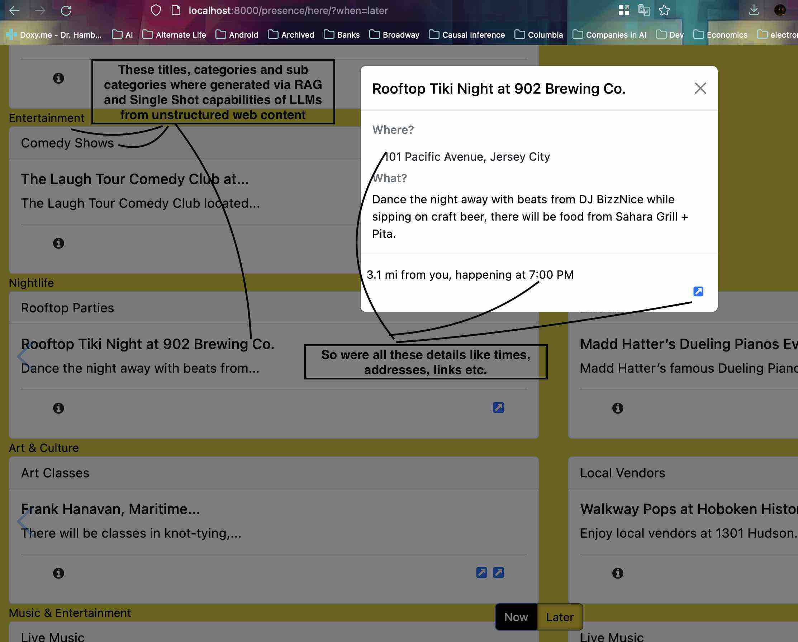

# What is this [demo](http://drophere.me)?
The demo is a PoC of productization of being *here, in The moment,* and conscious urban exploration. I have utilized AI (LLMs), OpenRouteService, FastAPI and K8s for building it.

The REST routes of the website encapsulate a conscious disposition of Time and Space I wanted to capture: Here and Now(or Later).

## Here == Location and Now/Later == Time
#### You always start with the *Where*:
[/presence/where](http://drophere.me/presence/where)
Plant a pin *Here* :)

### A Pin is planted *Here* and thus its where you are.

You are now dropped into the *Now* screen, the route is: [/presence/here/?when=now](http://drophere.me/presence/here/?when=now&lat=40.74816730666263&long=-74.04544830322267).

The UI has catagorized events happening *Now*(technically in < 1 hour or ongoing) around you.

### But we are also explorers, A Button press takes you to the *Later*: 
[/presence/here/?when=later](http://drophere.me/presence/here/?when=later&lat=40.74816730666263&long=-74.04544830322267)

*Later* UI has events technically happening > 1 hour from now or not on going.

### Not do anything, just relax?

If you just want Zen with immersive sound and visuals, toggle the screen with the button on the top left.

---- 
## How is this about travelling?
I consider myself a weekend traveller most of times and the Site has exactly that content. I go to explore the city and people around me on those days. This is a tool for a usecase of 1(at the moment). I hope it can grow.

# Who am I?
Awareness and being conscious of this moment are two ideas close to my heart. I also love to travel but one can also be a "traveller" within their city(One might say we all travel on the weekend) exploring places big and small. I live in Hoboken, NJ so the demo is only content from there.

# Tech stack
- This repo is just the front end(FastAPI, Jinja, Bootstap CSS, Swiper.js).
- It shows off the "*new*" AI for extracting structure from unstructured text to power website using basic RAG and Single Shot Retrieval. 
- The API and Data pipes that uses Smarts(OpenAI), OpenRouteService, FastAPI all in Python; It scrapes, augments and indexes the data into a DB (in Sqlite!).
The last two bits live in another repo [here](http://github.com/itissid/Drop-PoT.git)

# What it looks like?
(I am about to deploy the docker to the cloud, but here are some screenshots from the local docker container to explain the idea)
> *Landing Page: Drop a pin within the area(no location permissions requested)*


> *Next: The "Conscious Exploration" bits of :)*


> *Also importantly: The use of modern AI: A pipeline to retrieve structured info from unstructured text and use RAG(embeddings and the like) to enrich and classify the  content... So it does not appear like a smorgasbord of information.*


The stack that uses AI and generates the DB(in Sqlite!) is [here](http://github.com/itissid/Drop-PoT)

# What this repo contains?
The front end which calls the backend([here](http://github.com/itissid/Drop-PoT) and all the opsy stuff to get it onto a cloud(Ongoing).


# Stuff specific to building the demo(Opsy)
Docs are a WIP so things may not work in the short term as expected
## Building and Distributing the Wheel.
There were a lot of package install errors(Oh debian linux how precise you are) and wrangling with the initial pyproject.toml dependencies 
that needed rust/c++ etc. Often there were errors and it took a fair bit of time building them from wheels/sdists, so I removed the deps that were not needed to build these packages, cutting down immensely on the size of the final installed binaries. This took a while...

Iteration Loop(`code=>build=>deploy`): 
1. Build the wheel of the `drop_backed` project. Update it in the `herenow_demo`. Both of these should be installable via pip.
> A thing to note is that `poetry build`'s wheels don't exclude any deps from the pyproject.toml as explained [here](https://github.com/python-poetry/poetry/issues/2567#issuecomment-1100038202), but we can use `extras` in poetry and set the optional=true on them so that later pip does not install them unless we ask.

2. Once tested(from local docker), the builds will be tagged. We can copy them from the containers and push to pypi.
3. Use a second docker container to install these builds and deploy!

## Docker 1(DockerfileBuild): Tests if the wheels can be built and installed using pip:
0. Write code, prune unwanted deps in drop_backend.
 -  Run build.py to copy the code for docker build to find in its context:
 ```
 python build.py --pot-source=local --demo-source=local --pot-dir=/Users/sid/workspace/drop/ --demo-dir=/Users/sid/workspace/herenow_demo/
 ```
 > This creates a sandbox where the code for both projects is copied and then in that sandbox bumps the major/minor/patch version in pyproject.toml in `drop_backend` example `x.y.`z becomes alpha `x.y.(z+1)-alpha`

2. run `docker build ...` like so:
```
docker build --target backend-builder \
--build-arg DROP_BACKEND_DIR=drop_PoT \
--build-arg HERENOW_DEMO_DIR=herenow_demo  \
-t backend-image -f DockerfileBuild /tmp/subdir
```

- 2.1. Log into docker: `docker run -p 8000:8000 -it --entrypoint /bin/bash herenow_demo`
- 2.2. Fire up the python interpreter and try `import drop_backend` and look around if everything is fine.

- 2.3. Succeed? No -> Go back to 1 and repeat.
>  The configure_demo.py script runs and fills in the name of the built wheel of drop_backend in the pyproject.toml of herenow_demo. This is needed because the wheel name is not trivial to know until the wheel is built.
- 2.5 Now run the remaining docker build command:
```
docker build --target app-builder \
--build-arg DROP_BACKEND_DIR=drop_PoT
--build-arg HERENOW_DEMO_DIR=herenow_demo  \
-t app-image -f DockerfileBuild
/tmp/subdir
```
This will create the wheel of herenow_demo and install it in the docker container.

- 2.4. Upload drop_backend to pypi add dependency to herenow_demo. Make a git commit but don't push yet.

3. Fix bugs and prune unwanted deps in herenow_demo. Run build.py. 
4. Again run docker build command as above.
5. Did docker build succeed? No -> Go back to 4 and repeat
6. Log into the docker container:
```
docker run -p 8000:8000 -it --entrypoint /bin/bash herenow_demo
```
7. Try running the adhoc gunicorn command like so for the final test:
```
gunicorn herenow_demo.main:app --bind 0.0.0.0:8000 --workers 1 \
--worker-class uvicorn.workers.UvicornWorker \
-e SQLITE_DB_PATH='sqlite:////app/drop.db' \
-e RELOAD_WEBAPP=True \
-e SECRET_KEY='supersecret-key' \
-e ORS_API_ENDPOINT='http://127.0.0.1:8080/ors/v2/directions/{profile}' \
-e ALLOWED_ORIGINS='http://127.0.0.1:8000,http://localhost:8000'
```

## Check in the tags, preprep for docker build
1. Now use the tag from last step for both the projects.
>  Change the pyproject.toml for herenow_demo to use the tag for dependency of drop_backend.
3. Build and push both to pypi and git.
4. Make any changes to database necessary. 

## Docker 2(DockerfileDeploy): This will be the container that will host the app and the SQLite DB.
0. Build the DockerfileDeploy.
```
docker build \
  --build-arg SQLITE_DB_PATH="sqlite:////app/drop.db" \
  --build-arg RELOAD_WEBAPP="True" \
  --build-arg SECRET_KEY="somthingsupersecret-key" \
  --build-arg ORS_API_ENDPOINT="http://127.0.0.1:8080/ors/v2/directions/{profile}" \
  --build-arg ALLOWED_ORIGINS="http://127.0.0.1:8000,http://localhost:8000" \
  -t herenow_demo_deploy .

```
1. Run the container:
```
docker run -p 8000:8000 -d herenow_demo_deploy
```
2. Check on the browser one last time!
3. Now that both the deps are in the container, push to registry.

## Next(Deploy docker to cloud)
TODO

# Notes
While building the above i realized that I am actually doing a mini release strategy. Something that github or gitlab can probably help me
do, were this to ever become a product.


[1 Python poetry extras](https://github.com/python-poetry/poetry/issues/2567#issuecomment-1100038202)
